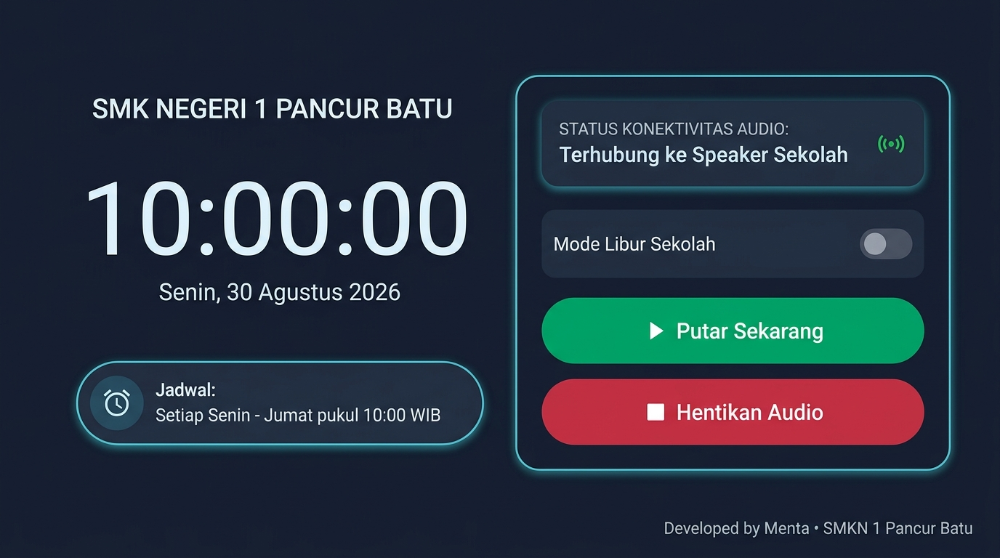
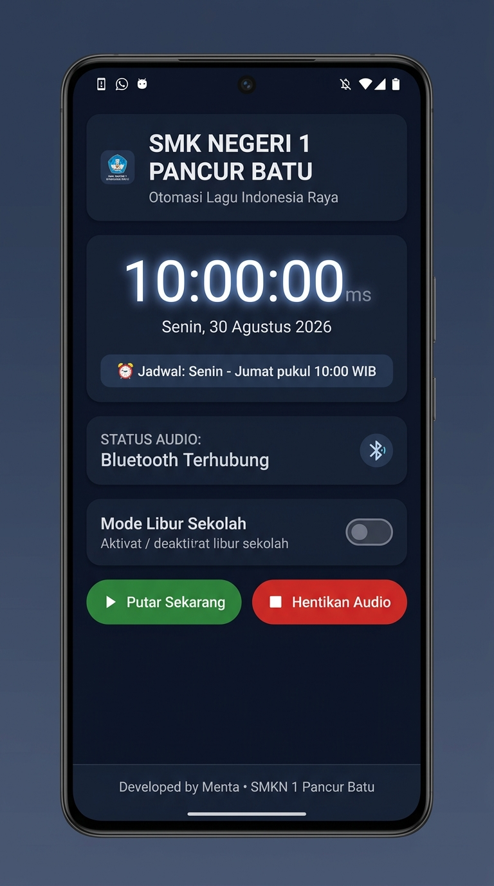

# 🇮🇩 Otomasi Lagu Indonesia Raya — SMK NEGERI 1 PANCUR BATU

[-3DDC84?style=for-the-badge&logo=android&logoColor=white)](https://developer.android.com)
[](https://github.com)
[](https://github.com)
[](https://github.com)

Aplikasi Android khusus untuk **Interactive Flat Panel (IFP / Smartboard)** dan **Smartphone** di lingkungan **SMK NEGERI 1 PANCUR BATU**. Aplikasi ini mengotomatiskan pemutaran lagu kebangsaan **Indonesia Raya** tepat pada pukul **10:00 WIB** setiap hari pembelajaran (Senin – Jumat) dengan konektivitas nirkabel ke sistem pengeras suara (speaker) sekolah.

---

## 📸 Preview Tampilan Aplikasi (Mockup UI)

Berikut adalah desain mockup antarmuka pengguna (*User Interface*) aplikasi yang dirancang dengan tema *Dark Slate Navy* modern, kontras tinggi, dan ramah layar sentuh:

### 📺 1. Tampilan Landscape (Khusus Smartboard IFP Layar Lebar 16:9)
> Dioptimalkan khusus untuk **Interactive Flat Panel (IFP)** di ruang kelas / aula dengan tata letak dua kolom terpisah (*split layout*), tombol sentuh ekstra besar, dan visual jam digital berukuran raksasa yang mudah dibaca dari kejauhan.



**Komponen Utama Layar Landscape:**
- **Panel Kiri:**
  - Header identitas resmi `SMK NEGERI 1 PANCUR BATU`.
  - Jam digital LED *real-time* format 24 jam (`10:00:00 WIB`) lengkap dengan hari dan tanggal Indonesia.
  - Kartu indikator jadwal otomatis (`Senin - Jumat, 10:00 WIB`).
- **Panel Kanan:**
  - Kartu Status Konektivitas Audio (Deteksi otomatis koneksi Bluetooth Speaker eksternal vs Speaker internal IFP).
  - Tombol Sakelar (*Switch*) **Mode Libur Sekolah** (Mencegah pemutaran otomatis saat libur semester/hari libur nasional).
  - Tombol Aksi Sentuh Besar: **▶ Putar Sekarang** (Hijau Emerald) dan **⏹ Hentikan Audio** (Merah Crimson).
  - Lencana Pengembang: *Developed by Menta • SMKN 1 Pancur Batu*.

---

### 📱 2. Tampilan Portrait (Smartphone & Tablet Vertikal)
> Dioptimalkan untuk perangkat seluler guru atau administrator sekolah dengan alur vertikal yang ramping, ringkas, dan mudah dioperasikan dengan satu tangan.

<p align="center">
  
</p>

---

## ✨ Fitur-Fitur Utama

1. ⏰ **Penjadwalan Otomatis Berpresisi Tinggi (*Exact Alarm*)**
   - Menggunakan `AlarmManager.setExactAndAllowWhileIdle()` untuk memastikan lagu diputar tepat pukul 10:00 WIB meskipun perangkat dalam kondisi *Doze Mode* (layar mati / hemat daya).
   - Penjadwalan otomatis dari hari Senin sampai Jumat dan melewati akhir pekan secara mandiri.

2. 🔊 **Konektivitas Audio Cerdas (Bluetooth & Speaker Internal)**
   - Mendeteksi ketersediaan profil `BluetoothA2dp` / `BluetoothHeadset` secara *real-time*.
   - Otomatis beralih ke speaker internal jika speaker nirkabel sekolah tidak terhubung.

3. 🎛️ **Manajemen Audio Focus & Foreground Service**
   - Berjalan sebagai *Android Foreground Service* dengan notifikasi persisten agar proses audio tidak dimatikan oleh sistem operasi.
   - Mengelola *Audio Focus* secara otomatis (menghentikan sementara aplikasi audio lain saat lagu kebangsaan berkumandang).

4. 🏖️ **Mode Libur Sekolah (*Holiday Mode*)**
   - Pengurus atau guru piket dapat mengaktifkan sakelar *Mode Libur* dengan satu sentuhan untuk menonaktifkan pemutaran otomatis selama masa liburan sekolah tanpa perlu menghapus aplikasi.

5. ⚡ **Auto-Start Saat Perangkat Menyala (*Boot Completed*)**
   - Dilengkapi `BroadcastReceiver` yang otomatis mendaftarkan ulang jadwal pemutaran setiap kali Smartboard atau Smartphone dinyalakan ulang (*reboot*).

6. 📱 **Desain UI Adaptif (Landscape IFP & Portrait Mobile)**
   - Mendukung orientasi *Landscape 16:9* untuk Smartboard dan *Portrait* untuk ponsel tanpa distorsi tampilan.

---

## 🛠️ Spesifikasi Teknis

| Spesifikasi | Keterangan |
| :--- | :--- |
| **Bahasa Pemrograman** | Kotlin 1.9+ |
| **Minimum SDK** | Android 8.0 Oreo (API Level 26) |
| **Target SDK** | Android 14+ (API Level 34) |
| **Arsitektur UI** | Android ViewBinding + Material Design 3 |
| **Audio Engine** | Android Native `MediaPlayer` + `AudioManager` |
| **Latar Belakang** | `ForegroundService` + `AlarmManager` + `BroadcastReceiver` |
| **Penyimpanan Lokal** | `SharedPreferences` (Status Mode Libur) |

---

## 🚀 Cara Menjalankan & Membangun Proyek

### 1. Prasyarat
- Android Studio Ladybug / Koala atau versi lebih baru.
- JDK 17 atau JDK 21 terpasang.
- Kabel USB / Koneksi Wi-Fi ADB untuk menghubungkan ke IFP Smartboard atau HP Android.

### 2. Langkah Kompilasi
```bash
# Clone repositori
git clone https://github.com/mentadp/SmkN1PancurBatuBell.git

# Masuk ke direktori proyek
cd SmkN1PancurBatuBell

# Build APK Debug
./gradlew assembleDebug
```
File APK yang dihasilkan akan berada di:
`app/build/outputs/apk/debug/app-debug.apk`

### 3. Instalasi ke Smartboard / HP
```bash
adb install app/build/outputs/apk/debug/app-debug.apk
```

---

## 👨‍💻 Pengembang & Hak Cipta

- **Pengembang:** Menta ([@mentadp](https://github.com/mentadp))
- **Institusi:** SMK NEGERI 1 PANCUR BATU
- **Lisensi:** Open-source untuk kemajuan pendidikan & otomasi sekolah.